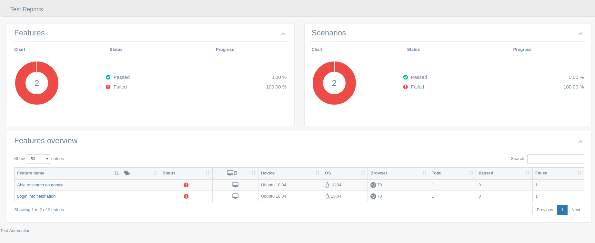

# cucumber-for-beginner

## What should we know first?
- What is BDD?
- What is Gherkin?
- What is Cucumber?
- What is a Step Defination?

## What is BDD?
### Behavior Driven Development
- Describes overall behaviors of the system
- Customer focused

it helps teams create business requirements that can be understood by the whole team

## What is Gherkin?
- Gherkin is the language Cucumber uses to define test cases
- It's non-technical
- Human readable

Gherkin doesn’t have to be connected to cucumber or test automation.
Many use it as a standardized way of creating requirements in the form of acceptance test

### Gherkin Keywords
```gherkin
  Given describes the pre-requisites for the expectation
   When describes the actual steps to carry on the effect of the expectation
   Then describes the verification that the expectations were met.
```
Consider the addition example to understand the above.
```
As a user of the calculator program
I want to have an addition method supported in the program
So that I can add two numbers
```
Further, BDD expects the desired behavior to be written in a Given, When, Then format. Consider the following expectations

```gherkin
  Given the calculator has an addition program
   When i choose to add 2 numbers
    And i add 2 and 2
   Then the result is 4
```
Now there are testing tools that help to automate and execute scenarios like above. So these specifications can actually serve as living documentation. If a requirement changes, the test has to change for it to execute successfully.

## What is Cucumber?
- Open source tool for test automation
- Test are written in Gherkin in feature file
- Uses regular expression to match Gherkin to a Cucumber step
- Cucumber step is what wraps the automation code

## What is a Step Defination?
As we are using JavaScript so a Step Definition is a JavaScript function with an expression that links it to one or more Gherkin steps. When Cucumber executes a Gherkin step in a scenario, it will look for a matching step definition to execute.

To illustrate how this works, look at the following Gherkin Scenario:

```gherkin
Scenario: Some cukes
  Given I have 48 cukes in my belly
```

The `I have 48 cukes in my belly` part of the step (the text following the Given keyword) will match the following step definition:

```js
const { Given } = require('cucumber')

Given('I have {int} cukes in my belly', function (cukes) {
  console.log(`Cukes: ${cukes}`)
});
```

For every steps which is written in feature files has a defination like above. 

### Feature File
A feature file is a description of a single feature of an application
Login would be an example of this
A feature file contains multiple tests
These are called scenarios
Scenarios contain steps written in the Given, When, Then Gherkin format

let's have a look an example
```gherkin
  Feature: The fieldnation login page should have verification on all field
    
    Scenario: Error message should become visible when I try to login with fake user
      Given I open the url "https://ui-test2.fndev.net/login"
       When I add "TADBuyer1Admin" to the inputfield "#email"
        And I add "invalid_password" to the inputfield "#password"
        And I click on the button "[data-nw-id='Log in']"
       Then I expect that the error alert should be like "Invalid username and password combination"
```

## Project installation 

### Requirements:
- You should have node version 6 or higher
- If you don't have node then download from [here](https://nodejs.org/en/)

### Quick start
1. Download the repository [here]() or clone the git repo — git clone https://github.com/shamrat17/cucumber-for-beginner.git
2. Now go to the project folder `cucumber-for-beginner` then open `terminal` on that directory and write
- `npm install` and press enter
3. If you want to run existing features then open up `terminal` and write
- `npm test`

Now you are ready to write your own features.

## How to write a test
Tests are written in Gherkin syntax that means that you write down what's supposed to happen in a real language. All test files are located in ./test/features/* and have the file ending .feature. 


### Check the list then start writting test using them

### Given steps
- `I open the (url|site) "([^"]*)?"` <br>Open a site in the current browser window/tab

### When steps
- `I (click|doubleclick) on the (link|button|element) "([^"]*)?"` <br>(Double)click a link, button or element
- `I (add|set) "([^"]*)?" to the inputfield "([^"]*)?"` <br>Add or set the content of an input field
- `I press (Enter|Return|Escape)` 
<br>Send keypress event
- `I wait for "([^"]*)?" seconds` 
<br>Set browser wait value to perform next step

### Then steps
- `I expect that the title is( not)* "([^"]*)?"` <br>Check the title of the current browser window/tab

__myFirstTest.feature__
```gherkin
Feature:
    In order to keep my product stable
    As a developer or product manager
    I want to make sure that everything works as expected

Scenario: Check title of website after search
    Given I open the url "http://google.com"
    When I set "Fieldnation" to the inputfield "#lst-ib"
    And I press "Enter"
    Then I expect that the title is "Fieldnation - Google Search"

```
This test opens the browser and navigates them to google.com to check if the title contains the search
query after doing a search. As you can see, it is pretty simple and understandable for everyone.

## How to run your written test/single test

```sh
$ npm test -- --spec ./test/features/myFirstTest.feature
```

if you want to run all test then write
```sh
$ npm test
```

## Test report

We already integrated a nice reporting module. After running each test it records the report in the `reports/index.html` file. So just browse this file in your web browser then you will see something like this:


